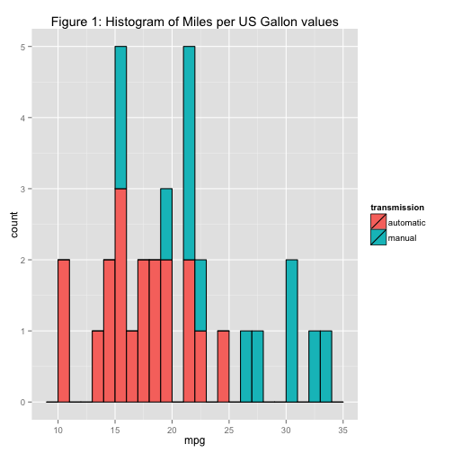
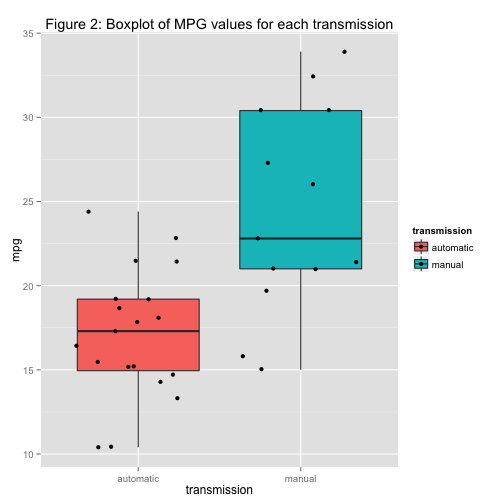
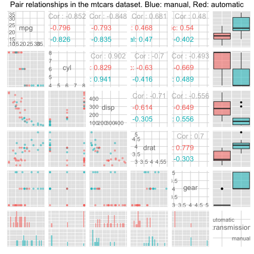

Factor analysis of car miles per gallon (MPG)
==========================


This document is my Course Project submission for the class "Regression Models" on Coursera.

# Summary

This study is an analysis of the very famous <mtcars dataset>(https://stat.ethz.ch/R-manual/R-devel/library/datasets/html/mtcars.html), available in R. It aims at explaining the possible relationships between a car's miles per gallon measure, and the different other characteristics of the car. In particular, we will focus our attention on the transmission in order to give an answer to the two following questions:

* Is an automatic or manual transmission better for MPG?
* How can we quantify the MPG difference between automatic and manual transmissions?

First of all, we will explore the data to get a better overview of the underlying patterns in the dataset, and then we will build several linear models to explain and quantify the relationships between transmission and MPG.

# Analysis

## Data exploration

### Loading data


```r
data(mtcars)
str(mtcars)
```

```
## 'data.frame':	32 obs. of  11 variables:
##  $ mpg : num  21 21 22.8 21.4 18.7 18.1 14.3 24.4 22.8 19.2 ...
##  $ cyl : num  6 6 4 6 8 6 8 4 4 6 ...
##  $ disp: num  160 160 108 258 360 ...
##  $ hp  : num  110 110 93 110 175 105 245 62 95 123 ...
##  $ drat: num  3.9 3.9 3.85 3.08 3.15 2.76 3.21 3.69 3.92 3.92 ...
##  $ wt  : num  2.62 2.88 2.32 3.21 3.44 ...
##  $ qsec: num  16.5 17 18.6 19.4 17 ...
##  $ vs  : num  0 0 1 1 0 1 0 1 1 1 ...
##  $ am  : num  1 1 1 0 0 0 0 0 0 0 ...
##  $ gear: num  4 4 4 3 3 3 3 4 4 4 ...
##  $ carb: num  4 4 1 1 2 1 4 2 2 4 ...
```

Our main focus is the relationship between transmission "am" variable (binary: 0 = automatic, 1 = manual) and the number of miles per US gallon "mpg" variable. For ease of use, let's build a "transmission" factor variable out of the "am"" variable:


```r
mtcars$transmission <- factor(mtcars$am, labels = c("automatic", "manual"))
mtcars <- subset(mtcars, select = -c(9))
```

### Data visualisation

Visualising "transmission" and "MPG" variables can help us understand the main patterns in the data. The figure 1 shows that manual cars tend to have higher MPG values. This is confirmed by Figure 2, as it appears clearly that the distribution of MPG for manual cars is higher than for automatic cars.


```r
library(ggplot2)
g1 <- ggplot(mtcars, aes(x=mpg, fill = transmission)) + 
  geom_histogram(binwidth = 1, col = "black") +
  ggtitle('Figure 1: Histogram of Miles per US Gallon values')
g2 <- ggplot(mtcars, aes(x=transmission, y=mpg, fill = transmission)) +
  geom_boxplot(adjust = 1) + geom_jitter(size = 2) +
  ggtitle('Figure 2: Boxplot of MPG values for each transmission')
```

Thus, this gives an indication about the answer of the first question: manual cars seem to be better for MPG.

However, this MPG difference is not necessarily explained by the transmission only. The transmission might indeed be related to other variables in the dataset that may explain that difference. We can visualise the relationships between pairs with a pair plot. In the figure 3 we notice that the transmission is highly related to other variables like "disp" (Displacement), "drat" (Rear axle ratio) and "cyl" (number of cylinders), and those variables are highly correlated to MPG. We have to be careful when quantifying the effect of transmission on MPG.


```r
library(stats);library(graphics)
g3 <- ggpairs(subset(mtcars, select = c(1,2,3,5,9,11)),
              colour = 'transmission', alpha = 0.6, 
              title = "Pair relationships in the mtcars dataset. Blue: manual, Red: automatic")
```

Thus, we will first model with only "transmission" as a predictor, and then we will add other variables in a more complex regression model to isolate and quantify the effect of transmission on MPG.

## Simple model


## Multivariate model and quantitative analysis

# Appendix
   
